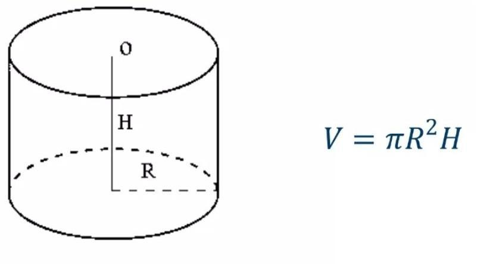

## Level 1
1. Возьмите пример из классной работы (с фигурами) и добавьте 2 новых метода
`calculateArea()` и `calculatePerimeter()` в Shape, после чего реализуйте методы 
в каждом наследнике (подсказки для сложных случаев)
- площадь круга `Pi*R*R`, периметр `2*Pi*R`
- площадь треугольника можно найти по формуле Герона: 
p = (a+b+c)/2 - это полупериметер (a, b, c стороны треугольника)
площадь равна `Math.sqrt(p*(p-a)*(p-b)*(p-c));`

P.S используйте `Math.PI` для числа p

2. создайте иерархию животных, для этого: 
- создайте package zoo
- создайте abstract class Animal с параметром животного name и color с пустым конструктором и конструктором с параметрами
- добавьте гетеры и сетеры
- добавьте методы `voice()`, `eat(String food)`
- создайте 2 наследников Predator(хищник) и Herbivore(травоядный)
- создайте 2 наследников для Predator - Cat, Dog
- создайте 2 наследников для Herbivore - Cow,Lamb
- переопределите методы voice и eat в каждом из наследников
- если нам на вход `eat` попалось слово `"meat"`, то травоядный должен сказать
`я такое не ем`
- добавьте метод `jump` c разными параметрами (используйте перегрузку метода - overloading)
- добавьте класс `ZooTest` в котором будет тестировать поведение животных
- попробуйте скормить животному мясо
- добавьте метод `toString()`

3. Разрешено ли множественное наследование в Java?
Исправьте код программы:
```
class Mother {

}

class Father {

}

class Child extends Mother, Father {

}

```

4. Исправьте код программы:

```
class Person extend Object {

}
```
PS: в этом задании класс Person должен явно наследоваться
от класса Object, пропишите наследование правильно.

5. Исправьте код программы так, что бы он компилировался.
   Класс Car менять нельзя.
   Классы ElectricCar и PetrolCar должны наследоваться
   от класса Car.
```
abstract class Car {

    abstract void accelerate();

}

class ElectricCar extends Car {

    private int batteryCharge;


}

class PetrolCar extends Car {

    private double petrolTankCapacity;

}
```

## Уровень 2

1. Создайте класс ShapeGenerator
- в классе должен быть метод `generate()` который c помощью Random создает число
  - если 0 - генерирует круг и вызывает метод draw
  - если 1 - генерирует квадрат и вызывает метод draw
  - если 2 - генерирует треугольник и вызывает метод draw

2. Расширить генератор фигур для Прямоугольника, 
и для объемных фигур: Куба и Цилиндра 
Для прямоугольника нужны 2 стороны
Для куба длина стороны
Для Цилиндра  высота цилиндра и радиус основания круга
 Периметр цилиндра посчитать невозможно, поэтому оставляйте числом 0
- добавьте метод `volume` в Shape3D для подсчета объема у 3d фигуры




3. Необходимо разработать класс "кредитная карта" CreditCard
   с учетом инкапсуляции, которая обладает следующими характеристиками:

Свойства
- Номер карты
- Пин-код карты
- Баланс
- Кредитный лимит
- Задолженность по кредиту


Методы

- Зачисление средств на карту ("deposit")
- Снятие средств с карты ("withdraw")

При создании карты нужно указывать ее номер и пинкод.
Начальный баланс и задолженность по кредиту равны 0.
Кредитный лимит можно менять после создания карты.

Требования к снятию средств:
- При снятии средств с карты необходимо указывать пин-код и желаемую сумму;
- Если пин-коды не совпадают, операция по снятию денег должна быть отклонена;
- Деньги снимаются с карточного баланса. В случае, если их не хватает, остаток суммы нужно брать за счет задолженности по кредиту;
- Если сумма задолженности превышает кредитный лимит, операция по снятию денег должна быть отклонена;

Требования к зачислению средств:
- При зачислении средств на карту необходимо указывать пин-код и желаемую сумму;
- Если пин-коды не совпадают, операция по зачислению денег должна быть отклонена;
- В первую очередь зачисление покрывает задолженность по кредиту;
- Если задолженность по кредиту равна 0, то остаток средств зачисляется в счет баланса;
